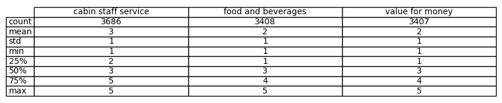

# `British Airways Customer Reviews Sentiment Analysis: Insights from Skytrax`
### `Project Overview`

#### `1. Introduction`

British Airways (BA) is the flag carrier airline of the United Kingdom (UK). Every day, thousands of BA flights arrive to and depart from the UK, carrying customers across the world. Whether it’s for holidays, work or any other reason, the end-to-end process of scheduling, planning, boarding, fuelling, transporting, landing, and continuously running flights on time, efficiently and with top-class customer service is a huge task with many highly important responsibilities.

- **Objective:** The goal of this project is to analyze customer reviews of BA airline using data scraped from [Skytrax](https://www.airlinequality.com/), perform sentiment analysis, identify key factors affecting customer satisfaction, and present your findings in a single page spread sheet.

- **Scope:** This project will involve data scraping, data cleaning, sentiment analysis, and presenting insights through visualizations and recommendations. For this project, we will be using python.

#### `2. Data Collection`
- **Source:** Skytrax website.
- **Method:** Python and libraries such as BeautifulSoup and Requests to scrape review data.
- **Data Collected:** Customer reviews, ratings for various aspects (e.g., cabin staff service, food and beverages), sentiment scores, and other relevant information.

#### `3. Data Cleaning and Preparation`
- **Handling Missing Values:** Deal with any missing or incomplete data and utilizing only verified customers.
- **Data Transformation:** Convert data types where necessary, tokenize text data, and prepare the data for analysis.

#### `4. Sentiment Analysis`
- **Method:** The Roberta sentiment analysis Pretrained Model from [HuggingFace](https://huggingface.co/cardiffnlp/twitter-roberta-base-sentiment) was used in analysising the sentiment of each review
- **Metrics:** The calculated sentiment scores of the positive, negative, neutral reviews was reviewed.

### 5. Data Analysis and Visualization
- **Descriptive Statistics:** We were able to scrape 3822 reviews from [Skytrax](https://www.airlinequality.com/), which includes verified customers and non-verified customers. For the purpose of this project, we will only be using the 2013 verified customers to be sure that the data we have are genuine. 

**Reviews from verified and non-verified customers.**

**Reviews from verified customers only.**

**5-Star point ratings for verified customers**
Zero represents customers that did not provide a star review for each category

**Recommendation from verified customers**

- **Correlation Analysis:** The correlations between sentiment scores and review ratings were compared.
- **Topic Modelling:** 
- **Visualization:**

### `6. Insights and Recommendations`
- **Key Findings:**
- **Actionable Recommendations:**

### `Note:`
- After running `pip install -r requirements.txt`, restart your jupyter notebook.
